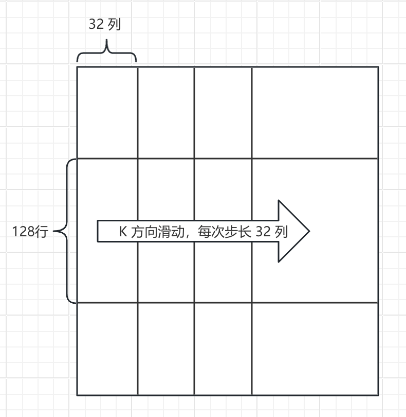
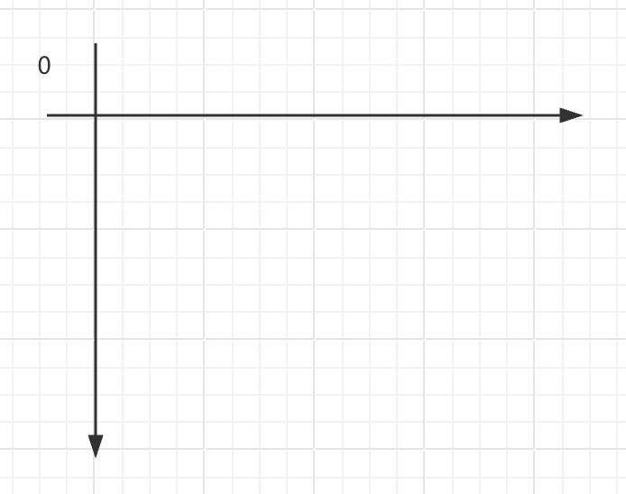
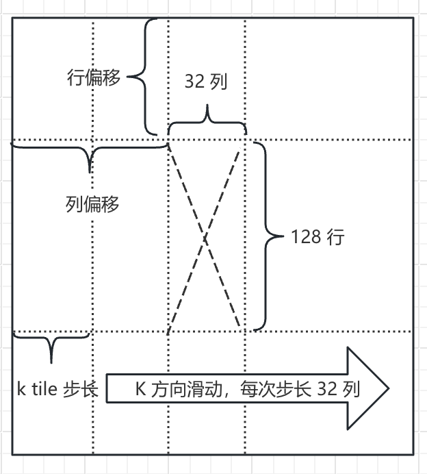
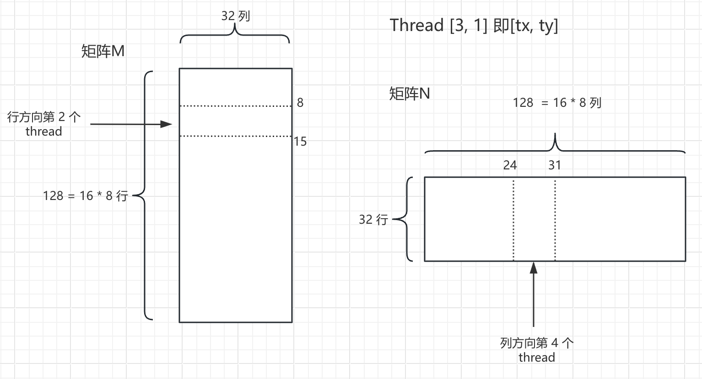

# 问题

我们在上一阶段的 tile 策略，是一个 block 里 16 x 16 个 thread，一次性从显存中读取 16 x 16个元素（一个 thread 读取一个），保存到单一 block 的 shared memory, 类似 s_M[16][16]. 

矩阵相乘的形式是 M[i][k] * N[k][j]。我们在这两个矩阵内沿着 k 方向滑动。这里的滑动指的是每个 block，基于它内部 thread 在全局的 i 跟 j 坐标，在 k 方向，从 0 开始，每次滑动一个 tile 长度，也就是每次滑动 16 个位置偏移。

举例：block [2, 3] 内部的 thread 的全局坐标（即 row, col）的区间， row: (48-63), col (32-47)。这个thread 区块，沿着 M 的 row （48-63） 方向，从 0 开始，每次跨步 16。沿着 N 的 col （32-47） 方向，从 0 开始，每次跨步 16. 对 M/N 同时一次性跨出 16 步长. 以这种分段的形式，将最终矩阵乘法的结果区间 row: (48-63), col (32-47)的 需要参与计算的 M/N 元素的乘积，分段做乘积。分段累积的加法和，即为最终矩阵乘法结果在该区间内的值。

这个策略中一个明显可以提升的地方在于，当前每个 thread 只计算乘法结果中的一个元素。而计算这一个元素，在单轮 tile 循环中，所有的数据都需要从共享内存（shared memory）中读取，然后放到寄存器（Register）中计算。我们可以考虑将批量的数据，先统一从共享内存中移动到寄存器里。通过降低共享内存的访问频率，在访问带宽最大的寄存器内实现高速运算，充分发挥gpu算力。

# 多级 tile 策略

## Thread tile 数据架构

为了充分发挥算力，我们提前在 register 中缓存数据，让每一个 thread 计算 8 x 8 个输出元素，而不是一个 thread 仅仅计算一个输出元素。

一个 block 在 x 方向有16 个 thread，每个 thread 在 x 方向计算 8 个输出元素。y 方向同理。

一个 block 

- 在 x 方向上合计 128 个输出元素。

- 在 Y 方向上合计 128 个输出元素。

## K 滑动方向 tile 数据架构

k 方向的滑动步长是 32，意味着在一轮步长的循环里，对于 M 来说，需要读 32 列；对于 N 来说，需要读 32 行。

对于一个 block，我们在 行/列 方向上各自需要最终计算 128 个输出元素，那我们在一个 k 步长里读取的数据，M 在 行方向取 128 行，N 在列方向取 128 列。

这个其实有个问题，我们是不是可以在一个 k 的步长里 M 取 127 行，或者 129 行？因为输出矩阵的 Tile 尺寸是由线程块维度和单线程工作量共同决定的（$16 \text{ threads} \times 8 = 128$），根据矩阵乘法规则 $C_{128 \times 128} = A_{128 \times 32} \times B_{32 \times 128}$，输入块的尺寸被矩阵乘法的维度对齐严格绑定，必须为 $128 \times 32$ 和 $32 \times 128$。

综合下来，对于一个 block，在一个 k 步长里，我们需要从全局显存中，分别搬运 4096（128 * 32） 个 M 元素跟 N 元素到共享内存中。一个 block 内共 256（16 * 16） 个 thread。平均每个 thread 需要搬运 16 （4096 / 256）个元素。

对于 M，共享内存的数据格式为

```c++
__shared__ float s_M[BLOCK_TILE_Y][TILE_K]; // 128 x 32
```

数据如图：



我们一共有 256 个 thread，且这些 thread 在 block 内部是 16 x 16 的二维形式。我们将这 256 个 thread 按照一维形式展开，代码如

```c++
int tid = ty * BLOCK_SIZE_X + tx; // 0 ~ 255 (把 2D 线程拉平成一维序号)
```

平铺后的一维 256 个thread，将同步读取 M 中连续内存空间的 256 个元素。一共读 16 次。在上图的一个 tile 步长里，256 个 thread 依次读取 M

- 第 0 到第 255 号元素
- 第 256 到第 511 号元素
- ...
- 第 3840 到第 4095 号元素

采用这样的读取方式，是配合 gpu warp（thread 0 - 31） 机制，连续 thread 同步读取连续内存地址，实现：

**合并访存（Coalesced）**

Thread 0 访问地址 $A$、Thread 1 访问 $A+1$、…… Thread 31 访问 $A+31$。显存控制器可以用一次 128 字节的总线事务（Transaction）直接把这 32 个 float 一次性取回来。带宽利用率接近 100%。

**小结： 256 个线程像“排刷”一样依次扫过**

* **第 $i = 0$ 轮循环**：
* 线程 `tid = 0` 搬第 0 个元素；
* 线程 `tid = 1` 搬第 1 个元素；
* ...
* 线程 `tid = 31` 搬第 31 个元素；
* 线程 `tid = 32` 搬第 32 个元素（即第 1 行第 0 列）；
* ...
* 线程 `tid = 255` 搬第 255 个元素。
* **这一轮，256 个线程搬完了前 256 个元素（刚好覆盖前 8 行：$8 \times 32 = 256$）。**


* **第 $i = 1$ 轮循环**：
* 整体偏移加 256 (`sm_index = tid + 256`)；


* 256 个线程搬运元素 `256 ~ 511`（对应第 8 ~ 15 行）。


* ...
* **第 $i = 15$ 轮循环**：
* 256 个线程搬运元素 `3840 ~ 4095`（最后 8 行）。


**总结一句话**：
在任意一轮 $i$ 中，**相邻的线程读取相邻的显存地址**。
每个线程执行 16 次，每次跳跃 256 个元素。

在对 M 元素搬运的过程中，我们需要写入共享内存上的二维下标，同时要读取 M 的二维下标。代码如下

```c++

    // 1. 申请共享内存 (各自 128x32，共 32KB)
    __shared__ float s_M[BLOCK_TILE_Y][TILE_K]; // 128 x 32

    int tx = threadIdx.x; // 0 ~ 15
    int ty = threadIdx.y; // 0 ~ 15
    int tid = ty * BLOCK_SIZE_X + tx; // 0 ~ 255 (线程一维 ID)

    // 本 Block 负责计算的输出矩阵区域的左上角全局行列索引
    int block_row = blockIdx.y * BLOCK_TILE_Y;
    int block_col = blockIdx.x * BLOCK_TILE_X;   

    // 2. 线程私有的寄存器数组，用于累加 8x8 的结果
    float sum[THREAD_TILE_Y][THREAD_TILE_X] = {0.0f};

    // 沿 K 维度分步滑动推进 (步长 32)
    int numTiles = (w + TILE_K - 1) / TILE_K;
    for (int t = 0; t < numTiles; t++) {
        int k_offset = t * TILE_K;

        // ---------- 协同搬运 M 到 s_M (128 x 32 = 4096 个元素) ----------
        // 256 个线程平分 4096 个元素，每个线程搬运 4096 / 256 = 16 个元素
        #pragma unroll
        for (int i = 0; i < 16; i++) {
            int sm_index = tid + i * 256;      // 0 ~ 4095
            int sm_row = sm_index / TILE_K;    // 0 ~ 127
            int sm_col = sm_index % TILE_K;    // 0 ~ 31

            int global_row = block_row + sm_row;
            int global_col = k_offset + sm_col;

            if (global_row < r && global_col < w) {
                s_M[sm_row][sm_col] = M[global_row * w + global_col];
            } else {
                s_M[sm_row][sm_col] = 0.0f;
            }
        }

        // 栅栏同步：确保 4096 个元素全部搬运完成
        __syncthreads();
    }

```

在当前这个步长范围内数据搬运完成后，应该加屏障 ` __syncthreads()`，确保全部 thread 都更新完。避免下一轮读到脏数据。

在矩阵运算中，我们采用的坐标系如下图，原点在左上方：




在上面代码中， `sm_row`, `sm_col` 是该 thread 读取的 M 中的元素，排在共享内存 128 x 32 中的坐标位置。

具体到排列的这个位置，对应在 M 中属于相同的尺寸，只不过在行方向跟列方向，需要在 `s_M` 的坐标基础上，分别加上对应的偏移。

如图：



对于 M 来说，行方向的上方偏移是该 thread 所在 block 读取元素的偏移，列方向是该 block 的 K 方向的偏移。

对于 N 的元素搬运，逻辑相似。只不过 N 的 k 方向是从上往下。

**举例：**

一个 block 在 grid 内的坐标为[2, 3] （[blockIdx.x, blockIdx.y]）, 那 block 内的 thread 的行方向坐标，也即 $y \in [48, 63]$, 列方向坐标，也即 $x \in [32, 47]$。这些 thread 实际计算的输出元素的全局坐标区间，  $y \in [48 * 8, 63 * 8 + 7]，x \in [32 * 8, 47 * 8 + 7]$ ， 也即 $y \in [384, 511]， x \in [256, 383]$。

我们将矩阵乘法结果 Out 的输出元素的坐标，跟这个 M/N 的元素坐标对齐，在这个 block内，

- 对于矩阵 M，固定行方向的区间 $y \in [384, 511]$ （16 * 8， 共128 行），在列方向（矩阵 M 的 k 方向就是列方向），从左往右，每个步长循环读取 32 列，直到最右边一个步长区间。
- 对于矩阵 N，固定列方向的区间 $x \in [256, 383]$，在行方向上（矩阵 N 的 k 方向就是行方向），从上往下，每个步长循环读取 32 行，直到最下面一个步长区间。

一个 thread 在这个 block 内的坐标为 [1, 2] （thread在 block 内坐标区间  $x,y \in [0, 15]$ ）。先计算它在 block 内平铺的 thread id： 18 = 1 * 16 + 2 （所有的 thread 的数量是 256）。它在一个 tile 步长里，一共需要读取 16 个元素，保存到 ` __shared__ float s_M[BLOCK_TILE_Y][TILE_K]; // 128 x 32` 里。我们需要将一维 thread id 索引转为二维坐标。

- 第0个元素的位置坐标，行： 0 = 18 / 32，列：18 = 18 % 32；
- 第1个元素的位置坐标，行： 8 = （18+256）/ 32， 列：18 = （18+256） % 32；
- ...
- 第 15 个元素的位置坐标，行： 120 = （18+256 * 15）/ 32， 列：18 = （18+256 * 15） % 32；

而它在 M 里读取的元素的行方向的上方偏移是：384 = 3 * （16 * 8），列方向的偏移，依赖于当前属于第几个 k 步长，假设当前是第二个步长，那列方向的偏移是 32 = 1 * 32。那么它读取的 M 的元素坐标。

- 第0个元素的位置坐标，行： 384 = 0 + 384，列：50 = 18 + 32；
- 第1个元素的位置坐标，行： 392 = 8 + 384，列：50 = 18 + 32；
- ...
- 第 15 个元素的位置坐标，行： 504 = 120 + 384， 列：50 = 18 + 32；

## Thread tile 分段乘积

这里采用了[矩阵乘法的外积形式](./matrix_outer_dot_product.md)，单个 thread 每次（共 k 次）从共享内存中，对于 M 固定第 k 列，读取 8行；对于 N 固定第 K 行，读取 8 列，移动到寄存器变量中。那么在这个寄存器中间变量中， M 是一个列向量，N 是一个行向量。对 M/N 各自从共享内存中读了 8 个元素，依照矩阵外积的形式，就可以做 8 * 8 的矩阵运算。这样子，我们访问共享内存 16 次，做了 64 次乘加运算。极大提升了`计算/访存`比效率。

如图所示：



图中，我们使用在 block 内部的坐标为 [3, 1] 的 thread 为例，沿着外点积方向，从M，N 中每轮（共 32 轮）从block的共享内存中搬运 8 个元素到thread的私有寄存器中。也即，M 读一列8行（8-15 行），N 读一行 8 列（24-31 列）。这个跟矩阵乘法的外积形式一致。

则乘积可以展开为：

$$
MN = \sum_{i=1}^k \mathbf{m}_i \mathbf{n}_i^T
= \mathbf{m}_1 \mathbf{n}_1^T + \mathbf{m}_2 \mathbf{n}_2^T + \cdots + \mathbf{m}_k \mathbf{n}_k^T
$$

每个项 $\mathbf{m}_i$ 为一列，$\mathbf{n}_i$ 为一行，长度均为 8。且 $K = 32$。 这是一个局部 `8 x 32` * `32 x 8` 的两个矩阵相乘的外积表示形式。 更多详情参考 [矩阵乘法的外积形式](./matrix_outer_dot_product.md)。


代码实现:

```c++
// 沿 K 维度分步滑动推进 (步长 32)
for (int t = 0; t < numTiles; t++) {
    // ---------- 计算：沿 K=32 展开，从共享内存读取到寄存器并做外积累加 ----------
    #pragma unroll
    for (int k = 0; k < TILE_K; k++) {
        // 寄存器缓存：每个线程读取它需要的 8 个 M 元素与 8 个 N 元素
        float reg_M[THREAD_TILE_Y];
        float reg_N[THREAD_TILE_X];

        #pragma unroll
        for (int i = 0; i < THREAD_TILE_Y; i++) {
            reg_M[i] = s_M[ty * THREAD_TILE_Y + i][k];
        }

        #pragma unroll
        for (int j = 0; j < THREAD_TILE_X; j++) {
            reg_N[j] = s_N[k][tx * THREAD_TILE_X + j];
        }

        // 在寄存器内完成 8x8=64 次 FMA 乘加
        #pragma unroll
        for (int i = 0; i < THREAD_TILE_Y; i++) {
            #pragma unroll
            for (int j = 0; j < THREAD_TILE_X; j++) {
                sum[i][j] += reg_M[i] * reg_N[j];
            }
        }
    }

    // 栅栏同步：确保计算完成，再进入下一轮 Tile 加载
    __syncthreads();
}
```

在当前这个步长范围内的局部乘积计算完成后，应该加屏障 `__syncthreads()`，确保全部 thread 都更新完。避免下一轮读到脏数据。

**计算复杂度对比**

假如我们使用内积的形式，来做这个局部矩阵乘法。计算每一个输出元素，需要做 32 次乘加运算，共享内存读 64 次。一共有 64 （8 * 8）个输出元素。那么计算乘加次数是 2,048 （32 * 64），共享内存读 4096 （64 * 64） 次。计算访存比 0.5 （2048 / 4096）。

因为我们使用了寄存器预先缓存。单轮外积，共享内存读 16 次，计算乘加次数 64 次。一共计算 32 轮，共享内存读 512 （16 * 32）次，计算乘加次数 2048 （64 * 32）次。计算访存比 4 （2048 / 512）。

局部矩阵，随着 K 方向滑动，最终计算得到单个 thread 所对应的全部输出元素（ 8 * 8）的完整值。将完整值保存到显存中。

```c++
// 3. 将 8x8 的计算结果写回全局显存 Out
#pragma unroll
for (int i = 0; i < THREAD_TILE_Y; i++) {
    int global_row = block_row + ty * THREAD_TILE_Y + i;
    #pragma unroll
    for (int j = 0; j < THREAD_TILE_X; j++) {
        int global_col = block_col + tx * THREAD_TILE_X + j;
        if (global_row < r && global_col < w) {
            Out[global_row * w + global_col] = sum[i][j];
        }
    }
}
```

**屏障的完整展示**

屏障在 k 方向滑动时，确保每轮数据不会被下轮数据覆盖。

```c++
// 沿 K 维度分步滑动推进 (步长 32)
for (int t = 0; t < numTiles; t++) {
    // 1. 协同搬运 M 和 N 到 Shared Memory (s_M, s_N)
    ...
    __syncthreads(); // 屏障 1：保证本轮 Tile 数据全部加载完成

    // 2. 从 Shared Memory 缓存到寄存器并做外积累加
    ...
    __syncthreads(); // 屏障 2：保证本轮所有线程计算完毕，避免覆盖下一轮数据
}
```
